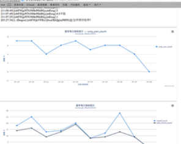
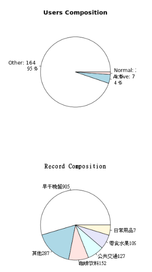
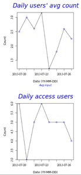

# Wechat for Woojuu -- 记账的微信应用
=========
## Record your daily expense, record your daily life

  

## Why we do this?
- Help users to form the habit of recording daily expense
- Enable expense data to provide meaningful feedback
- Get hands wet for AI chat and data analysis

### screenshots
     
      

## Installation

- verified on Darwin12.4, ubuntu10.4

| Name                                   | Comment                                                    |
|:----------------------------------------|------------------------------------------------------------|
| Checkout github                        | https://github.com/DennyZhang/WechatWoojuu                     |
| Install python modules                 | pip instal flask jinjia hashlib; mmseg; aiml                           |
| Set WECHAT_HOME env                    | export WECHAT_HOME="/Users/maccode/wechatwoojuu" |
| Start service as uwsgi                 | uwsgi -x /root/website/uwsgi_config.xml -M -t 30 -A 1 -p 1 -d /var/log/uwsgi.log --vhost |

## Documents: find . -iname "*.md"
| Name                                   | Comment                    |
|:----------------------------------------|---------------------------|
| Webservice API                         |      ./webservice.md       |  
| Emoji definition table                 |      ./emoji.md            |
